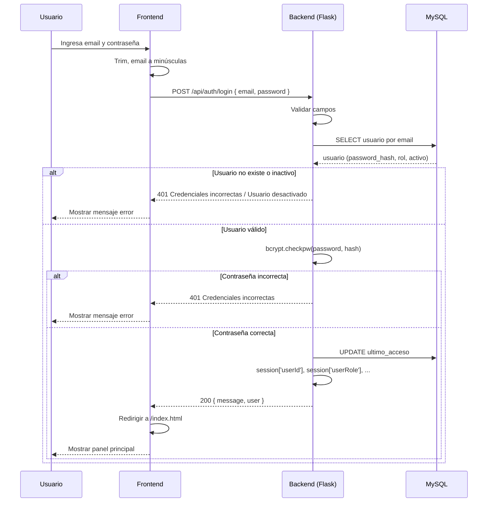
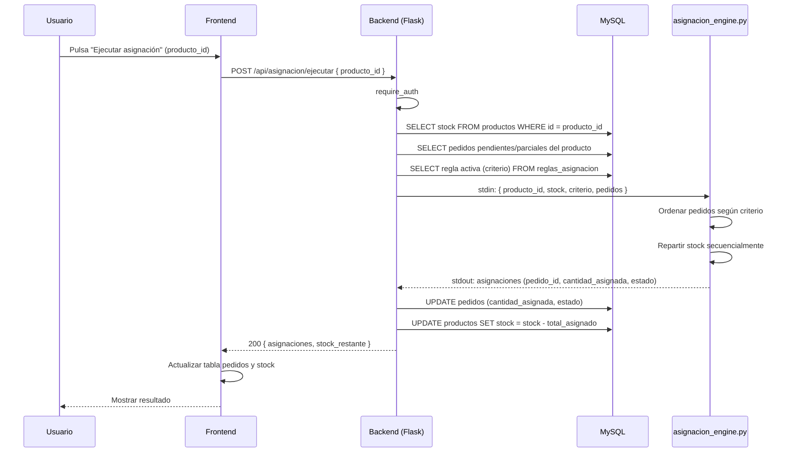
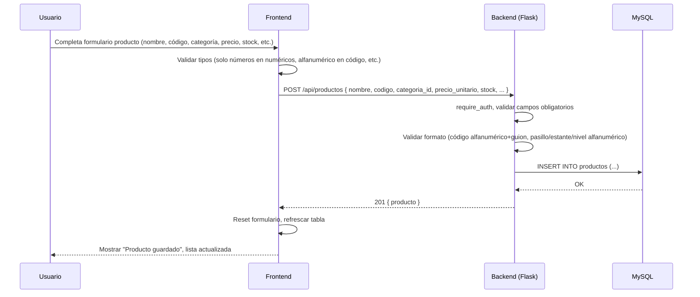
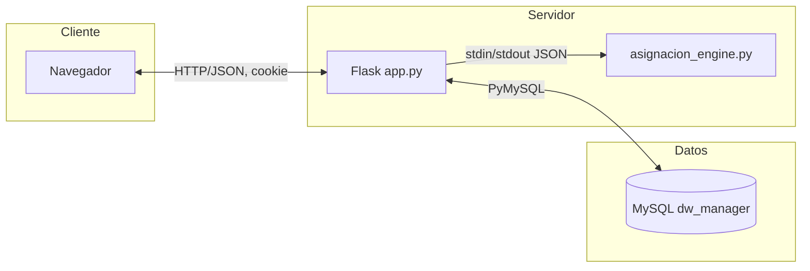

# Documentación del Sistema DW Manager

## 1. Contexto

**DW Manager** es un sistema web de gestión de inventario y almacén con capacidades de Business Intelligence (BI). Surge de la necesidad de integrar en una sola aplicación:

- **Operaciones transaccionales**: alta, baja y modificación de productos, categorías, sucursales; registro de movimientos de entrada/salida; creación y asignación de pedidos.
- **Reglas de negocio**: prioridad de pedidos y criterios de asignación de stock (FIFO, mayor prioridad, menor cantidad, etc.).
- **Análisis multidimensional (OLAP)**: cubo de ventas sobre dimensiones producto, tiempo y sucursal, con operaciones de rollup, drill-down, slice y dice para reportes y dashboards.

El sistema utiliza **MySQL** como base de datos transaccional y como almacén dimensional (Data Warehouse), **Flask** como backend en Python, y un frontend estático (HTML/CSS/JavaScript) que consume una API REST. La autenticación es por sesión (cookie), con roles (administrador, operador, usuario) que condicionan el acceso a ciertas funcionalidades (por ejemplo, solo el administrador configura las reglas de asignación).

---

## 2. Objetivo General

Desarrollar un sistema integrado de **gestión de inventario y almacén** con **análisis OLAP** que permita a la organización controlar productos, movimientos, pedidos y reglas de asignación, y explotar datos de ventas mediante consultas multidimensionales y dashboards, garantizando trazabilidad, consistencia de datos y una interfaz única según el rol del usuario.

---

## 3. Objetivos Específicos

1. **Autenticación y autorización**: Permitir registro e inicio de sesión de usuarios con validación de dominio de correo (gmail, hotmail, dw), contraseñas con hash bcrypt y gestión de sesión; diferenciar roles (administrador, operador, usuario) para restringir acceso a funcionalidades sensibles.
2. **CRUD de catálogos**: Gestionar productos (nombre, código, categoría, precio, stock, punto de reorden, ubicación pasillo/estante/nivel), categorías y sucursales (nombre, ciudad, estado, región) con validación de tipos de dato y sin espacios al inicio en los campos.
3. **Movimientos de inventario**: Registrar entradas (compra, devolución) y salidas (venta, baja) con actualización automática de stock, historial por usuario y observaciones.
4. **Pedidos y asignación**: Crear pedidos con producto, cantidad, prioridad y referencia de cliente; ejecutar asignación de stock según una regla activa (FIFO, mayor prioridad, menor cantidad, etc.) mediante un motor externo (`asignacion_engine.py`) y actualizar estados (pendiente, parcial, surtido).
5. **Reglas de asignación**: Permitir al administrador configurar y activar una única regla de asignación (criterio y nombre) que determine el orden de reparto de stock entre pedidos del mismo producto.
6. **Alertas y panel**: Mostrar productos bajo punto de reorden, pedidos pendientes y métricas de ocupación del almacén en un panel principal.
7. **Data Warehouse y OLAP**: Mantener dimensiones (producto, tiempo, sucursal) y hechos de ventas; ofrecer API para refrescar el cubo, KPIs (estadísticas, top productos, ranking sucursales, tendencia mensual), análisis temporal, rollup por año/trimestre/mes, drill-down por categoría/producto y operaciones slice/dice.
8. **Usabilidad y calidad de datos**: Evitar espacios al inicio/fin en campos CRUD; restringir cada campo al tipo de dato requerido (solo letras en nombres de categoría/sucursal, alfanumérico en código, números en cantidades y precios).

---

## 4. Requerimientos Funcionales

| ID | Requerimiento | Prioridad |
|----|----------------|-----------|
| RF01 | **Acceso y roles.** El sistema debe permitir crear cuenta, iniciar y cerrar sesión (con correo y contraseña), mantener al usuario identificado durante la navegación y distinguir al administrador del resto: solo el administrador configura las reglas de asignación; los demás usan productos, movimientos, pedidos y reportes. | Alta |
| RF02 | **Gestión de catálogos.** El sistema debe permitir dar de alta, modificar y eliminar productos (nombre, código, categoría, precio, stock, punto de reorden, ubicación), categorías y sucursales (nombre, ciudad, estado, región), y validar que en cada campo solo se ingresen datos válidos (números donde corresponda, letras en nombres, sin espacios al inicio). | Alta |
| RF03 | **Movimientos de inventario.** El sistema debe permitir registrar entradas (compra, devolución) y salidas (venta, baja) con cantidad y observaciones, actualizar automáticamente el stock y consultar el historial de movimientos. | Alta |
| RF04 | **Pedidos y asignación.** El sistema debe permitir crear pedidos (producto, cantidad, prioridad, cliente), listar pedidos por estado (pendiente, parcial, surtido) y ejecutar la asignación de stock según la regla activa; el administrador debe poder ver y elegir la regla activa (FIFO, mayor prioridad, menor cantidad, prioridad cliente). | Alta |
| RF05 | **Panel y reportes.** El sistema debe mostrar en el panel principal métricas (productos agotados, pedidos pendientes, ocupación del almacén), alertas de bajo stock y reportes de ventas (totales, productos más vendidos, ranking sucursales, tendencia mensual y análisis por periodo, categoría o sucursal). | Alta |

---

## 5. Requerimientos No Funcionales

| ID | Requerimiento | Categoría |
|----|----------------|-----------|
| RNF01 | **Portabilidad.** La aplicación debe poder instalarse y ejecutarse en un equipo local (Windows, Linux o Mac) usando una base de datos MySQL en el mismo equipo o en un servidor accesible. | Portabilidad |
| RNF02 | **Seguridad.** Las contraseñas deben almacenarse cifradas; la sesión debe protegerse frente a accesos no autorizados desde el navegador; y los datos sensibles (conexión a la base de datos, clave de sesión) no deben estar en el código sino en configuración externa. | Seguridad |
| RNF03 | **Usabilidad.** Las respuestas del sistema (éxito, error, datos no válidos) deben ser claras y coherentes, y el sistema debe soportar correctamente letras con acentos y caracteres del español (ñ, tildes) en todos los textos. | Usabilidad |
| RNF04 | **Rendimiento.** Las pantallas y consultas habituales (listados, guardar, panel, reportes) deben cargar en un tiempo razonable (pocos segundos) para que el uso diario sea fluido. | Rendimiento |
| RNF05 | **Mantenibilidad.** La configuración que cambia entre entornos (servidor de base de datos, puerto, claves) debe estar en un archivo o variables de entorno separados del código, para facilitar el despliegue y evitar exponer datos sensibles. | Mantenibilidad |

---

## 6. Alcances y Limitaciones

**Alcances** definen las metas, entregables y límites del sistema (qué se hará). **Limitaciones** especifican las restricciones, obstáculos y exclusiones (qué no se cubrirá).

---

### Alcances (qué se hará)

**Metas**
- Ofrecer un sistema único para operar el inventario (productos, movimientos, pedidos) y consultar reportes de ventas.
- Permitir asignar stock a pedidos de forma automática según una regla configurable (por ejemplo: primero en llegar, mayor prioridad, menor cantidad).
- Diferenciar al administrador del resto de usuarios (solo el administrador configura las reglas de asignación).

**Entregables**
- **Acceso y seguridad:** Registro de usuarios, inicio y cierre de sesión; validación de correo (dominios gmail, hotmail, dw) y contraseña mínima de 8 caracteres.
- **Panel principal:** Métricas de inventario (productos agotados, pedidos pendientes, ocupación del almacén) y alertas de productos bajo punto de reorden.
- **Productos:** Alta, edición y baja de productos; búsqueda y filtro por categoría; datos de ubicación (pasillo, estante, nivel), precio, stock y punto de reorden.
- **Categorías y sucursales:** Alta, edición y baja de categorías y de sucursales (nombre, ciudad, estado, región).
- **Entradas y salidas:** Registro de movimientos (compra, devolución, venta, baja) con actualización automática de stock e historial consultable.
- **Pedidos:** Creación de pedidos (producto, cantidad, prioridad, cliente/referencia); listado por estado (pendiente, parcial, surtido); ejecución de asignación de stock según la regla activa.
- **Reglas de asignación (solo administrador):** Consulta y selección del criterio activo (FIFO, mayor prioridad, menor cantidad, prioridad cliente).
- **Dashboard y análisis:** Reportes de ventas (totales, productos más vendidos, ranking sucursales, tendencia mensual); análisis temporal y consultas por año, trimestre, mes, categoría o sucursal.

**Límites del sistema**
- Solo un criterio de asignación activo a la vez; la asignación se ejecuta por producto cuando el usuario lo solicita.
- El registro de usuarios queda limitado a correos con dominio gmail, hotmail o dw por decisión de alcance.
- Los reportes de ventas se basan en datos cargados o actualizados en el almacén de reportes (no en tiempo real con cada venta registrada).

---

### Limitaciones (qué no se cubrirá)

**Restricciones del sistema**
- Solo se permiten correos con dominio gmail, hotmail o dw para registrarse; no se aceptan otros dominios.
- La interfaz está diseñada para uso en computadora (escritorio); no hay versión adaptada ni optimizada para celulares o tablets.
- Solo puede haber una regla de asignación activa para todo el sistema; no es posible usar reglas distintas por producto ni por sucursal al mismo tiempo.

**Qué queda fuera del alcance**
- El sistema no separa datos por empresa ni por sucursal en productos, movimientos y pedidos: todos los usuarios trabajan sobre el mismo catálogo de productos y el mismo inventario.
- Los reportes del dashboard no se actualizan al instante con cada venta o movimiento; dependen de que se ejecute antes una carga o actualización de datos.
- No se entrega aplicación móvil instalable ni notificaciones en el dispositivo; el acceso es únicamente por navegador web.
- No forman parte de este sistema: facturación a clientes, gestión de compras a proveedores ni precios diferentes por sucursal.

---

## 7. Casos de Uso y Diagramas de Secuencia

### 7.1 Casos de uso (resumen)

| CU | Nombre | Actor | Descripción |
|----|--------|--------|-------------|
| CU01 | Registrarse | Usuario no autenticado | Registrar cuenta con nombre, email (dominio permitido) y contraseña (mín. 8 caracteres). |
| CU02 | Iniciar sesión | Usuario | Autenticarse con email y contraseña; obtener sesión. |
| CU03 | Cerrar sesión | Usuario autenticado | Invalidar sesión. |
| CU04 | Gestionar productos | Usuario autenticado | Listar, crear, editar y eliminar productos (CRUD). |
| CU05 | Registrar movimiento | Usuario autenticado | Registrar entrada o salida de inventario; actualizar stock. |
| CU06 | Crear pedido | Usuario autenticado | Crear pedido con producto, cantidad, prioridad y cliente. |
| CU07 | Ejecutar asignación | Usuario autenticado | Para un producto, ejecutar asignación de stock según regla activa. |
| CU08 | Configurar regla de asignación | Administrador | Cambiar la regla activa (criterio) de asignación. |
| CU09 | Consultar panel y alertas | Usuario autenticado | Ver métricas (agotados, pendientes, ocupación) y alertas de bajo stock. |
| CU10 | Consultar análisis OLAP | Usuario autenticado | Consultar KPIs, tendencias, rollup, drill-down, slice/dice. |

### 7.2 Diagrama de secuencia – CU02 Iniciar sesión



### 7.3 Diagrama de secuencia – CU07 Ejecutar asignación



### 7.4 Diagrama de secuencia – CU04 Crear producto (CRUD)



---

## 8. Justificación

El sistema se justifica por:

1. **Unificación**: Una sola aplicación para operación de almacén (inventario, movimientos, pedidos) y análisis (OLAP, KPIs), reduciendo dispersión de herramientas.
2. **Trazabilidad**: Movimientos y pedidos quedan asociados a usuario y fecha; las reglas de asignación son auditable (una regla activa definida).
3. **Escalabilidad del análisis**: El modelo dimensional (producto, tiempo, sucursal) y las operaciones OLAP permiten crecer en métricas y reportes sin reescribir la operación transaccional.
4. **Seguridad**: Contraseñas hasheadas, sesiones controladas y roles que limitan quién puede cambiar reglas críticas (administrador).
5. **Mantenibilidad**: Backend en Python/Flask y BD en MySQL son ampliamente conocidos; la API REST facilita futuros clientes (móvil, integraciones).
6. **Calidad de datos**: Validaciones en frontend y backend (tipos de dato, sin espacios al inicio) reducen errores de captura y consistencia en la base de datos.

---

## 9. Modelo Entidad-Relación

Descripción conceptual de entidades y relaciones (equivalente al esquema físico en `schema-mysql.sql`).

### Entidades principales (operacionales)

- **Usuario**: id, nombre_completo, email (único), password_hash, rol, activo, ultimo_acceso, created_at.
- **Categoría**: id, nombre (único).
- **Producto**: id, nombre, codigo (único), categoria_id (FK Categoría), precio_unitario, stock, punto_reorden, pasillo, estante, nivel.
- **Movimiento**: id, producto_id (FK Producto), tipo (entrada_compra, entrada_devolucion, salida_venta, salida_baja), cantidad, usuario_id (FK Usuario), observaciones, created_at.
- **Pedido**: id, producto_id (FK Producto), cantidad_solicitada, cantidad_asignada, estado (pendiente, parcial, surtido, cancelado), prioridad, cliente_ref, fecha_solicitud, usuario_id (FK Usuario).
- **Regla_asignacion**: id, nombre, criterio, activo, created_at.

### Entidades del Data Warehouse

- **dim_sucursal**: sk_sucursal, id_sucursal, nombre_sucursal, ciudad, estado, region.
- **dim_producto**: sk_producto, id_fuente (FK lógica a Producto), nombre, categoria.
- **dim_tiempo**: sk_tiempo, fecha, dia, mes, nombre_mes, trimestre, anio, nombre_dia_semana, es_fin_de_semana, semana_del_anio.
- **fact_ventas**: id_hecho, sk_producto (FK dim_producto), sk_tiempo (FK dim_tiempo), sk_sucursal (FK dim_sucursal), cantidad, monto_total.

### Relaciones (cardinalidad)

- Un **Producto** pertenece a una **Categoría** (N:1).
- Un **Movimiento** referencia un **Producto** y opcionalmente un **Usuario** (N:1).
- Un **Pedido** referencia un **Producto** y opcionalmente un **Usuario** (N:1).
- **fact_ventas** referencia una combinación (sk_producto, sk_tiempo, sk_sucursal) (N:1 con cada dimensión).

### Diagrama ER (conceptual, notación simplificada)

```mermaid
erDiagram
    USUARIO ||--o{ MOVIMIENTO : "registra"
    USUARIO ||--o{ PEDIDO : "crea"
    CATEGORIA ||--o{ PRODUCTO : "agrupa"
    PRODUCTO ||--o{ MOVIMIENTO : "afecta"
    PRODUCTO ||--o{ PEDIDO : "solicitado_en"
    PRODUCTO }o--|| DIM_PRODUCTO : "id_fuente"
    FACT_VENTAS }o--|| DIM_PRODUCTO : "sk_producto"
    FACT_VENTAS }o--|| DIM_TIEMPO : "sk_tiempo"
    FACT_VENTAS }o--|| DIM_SUCURSAL : "sk_sucursal"
    REGLAS_ASIGNACION ||--o| : "una activa"
```

---

## 10. Modelo Relacional

Esquema relacional derivado del ER (tablas y claves).

### Tablas transaccionales

- **usuarios** (id PK, nombre_completo, email UK, password_hash, rol, activo, ultimo_acceso, created_at)
- **categorias** (id PK, nombre UK)
- **productos** (id PK, nombre, codigo UK, categoria_id FK→categorias.id, precio_unitario, stock, punto_reorden, pasillo, estante, nivel)
- **movimientos** (id PK, producto_id FK→productos.id, tipo, cantidad, usuario_id FK→usuarios.id, observaciones, created_at)
- **pedidos** (id PK, producto_id FK→productos.id, cantidad_solicitada, cantidad_asignada, estado, prioridad, cliente_ref, fecha_solicitud, usuario_id FK→usuarios.id)
- **reglas_asignacion** (id PK, nombre, criterio, activo, created_at)

### Tablas dimensionales y hechos

- **dim_sucursal** (sk_sucursal PK, id_sucursal, nombre_sucursal, ciudad, estado, region)
- **dim_producto** (sk_producto PK, id_fuente UK, nombre, categoria)
- **dim_tiempo** (sk_tiempo PK, fecha UK, dia, mes, nombre_mes, trimestre, anio, nombre_dia_semana, es_fin_de_semana, semana_del_anio)
- **fact_ventas** (id_hecho PK, sk_producto FK→dim_producto, sk_tiempo FK→dim_tiempo, sk_sucursal FK→dim_sucursal, cantidad, monto_total; UK (sk_producto, sk_tiempo, sk_sucursal, monto_total))

Otras tablas del sistema: **ventas** (transaccional opcional), **etl_log** (registro de ETL).

---

## 11. Normalización de la Base de Datos y Justificación

### Formas normales aplicadas

- **1FN**: Todas las tablas tienen dominios atómicos (no hay listas o conjuntos en un atributo). Las claves primarias están definidas (id o sk_).
- **2FN**: No hay dependencias parciales de la clave. Por ejemplo, en **productos** los atributos no clave dependen de la clave completa (id); categoria_id depende de id en el sentido de que cada producto tiene una categoría.
- **3FN**: Se eliminan dependencias transitivas. En el modelo transaccional, no se repite el nombre de la categoría en **productos** (solo categoria_id); en **dim_producto** se desnormaliza a propósito la categoría como atributo para el DW (nombre de categoría en la dimensión), lo cual es una decisión de diseño para OLAP (evitar joins en consultas agregadas).

### Desnormalización controlada (DW)

- **dim_producto**: Incluye `categoria` (nombre) además de `nombre` del producto para facilitar consultas por categoría sin join a una tabla de categorías en el DW.
- **dim_tiempo**: Contiene atributos derivados (nombre_mes, trimestre, nombre_dia_semana) para facilitar agrupaciones y filtros en reportes.
- **fact_ventas**: Se mantiene en forma normal; la granularidad es (producto, tiempo, sucursal) con cantidad y monto.

### Justificación

- La normalización en tablas operacionales (usuarios, categorias, productos, movimientos, pedidos, reglas_asignacion) reduce redundancia y anomalías de actualización, y mantiene integridad referencial.
- En el DW, la desnormalización leve en dimensiones (por ejemplo categoría en dim_producto) prioriza la velocidad de consultas OLAP y la simplicidad de las vistas de negocio, asumiendo que la dimensión se actualiza vía ETL de forma controlada.

---

## 12. Herramientas a Utilizar

| Ámbito | Herramienta | Uso |
|--------|-------------|-----|
| Backend | Python 3 | Lenguaje del servidor. |
| Framework web | Flask 3.x | API REST, sesiones, rutas, middleware. |
| Base de datos | MySQL 8.x (o compatible) | BD transaccional y almacén dimensional. |
| Conexión BD | PyMySQL | Driver Python para MySQL. |
| Seguridad | bcrypt | Hash de contraseñas. |
| Configuración | python-dotenv | Carga de variables .env (MYSQL_*, SESSION_SECRET, PORT). |
| Frontend | HTML5, CSS3, JavaScript | Páginas estáticas, estilos, lógica cliente. |
| Servidor estático | Flask (static_folder) | Servir `public/` (index.html, login.html, app.js, style.css). |
| Scripts | Python (scripts/) | Motor de asignación (asignacion_engine.py), resetear password, cambiar rol, crear usuario prueba. |
| SQL | MySQL Workbench / línea de comandos | Ejecución de schema-mysql.sql, INICIALIZAR_MYSQL_WORKBENCH.sql, ETL y procedimientos. |
| Control de versiones | Git | Código y documentación (opcional). |

---

## 13. Arquitectura del Sistema

### Capas

1. **Presentación (cliente)**: Navegador; HTML/CSS/JS en `public/`. Páginas: login (registro e inicio de sesión), index (panel, productos, movimientos, pedidos, reglas, sucursales, categorías, dashboards OLAP). Las peticiones a la API son fetch con `credentials: 'include'` para enviar la cookie de sesión.
2. **Lógica de aplicación (servidor)**: Flask (`app.py`). Rutas `/api/*` para autenticación, CRUD de productos/categorías/sucursales, movimientos, pedidos, reglas de asignación, ejecución de asignación, y endpoints OLAP. Middleware: autenticación (session), CORS, cierre de conexión BD. El motor de asignación se invoca como proceso externo (subprocess) con entrada/salida JSON.
3. **Datos**: MySQL. Incluye tablas transaccionales (usuarios, categorias, productos, movimientos, pedidos, reglas_asignacion, ventas), tablas dimensionales (dim_sucursal, dim_producto, dim_tiempo), tabla de hechos (fact_ventas) y soporte ETL (etl_log, procedimientos/poblado de dim_tiempo).

### Flujo de datos (resumen)

- **Login**: Cliente → POST /api/auth/login → Flask valida y consulta MySQL → crea sesión → responde con user y Set-Cookie.
- **CRUD**: Cliente → GET/POST/PUT/DELETE /api/productos | categorias | sucursales | movimientos | pedidos → Flask (require_auth) → MySQL → JSON.
- **Asignación**: Cliente → POST /api/asignacion/ejecutar → Flask obtiene stock, pedidos y regla activa desde MySQL → invoca asignacion_engine.py → actualiza pedidos y stock en MySQL → responde al cliente.
- **OLAP**: Cliente → GET /api/olap/... → Flask consulta fact_ventas y dimensiones → agrega y filtra → devuelve JSON.

### Diagrama de arquitectura (bloques)



---

## Referencias

- Esquema de base de datos: `sql/schema-mysql.sql`, `sql/INICIALIZAR_MYSQL_WORKBENCH.sql`
- Documentación de pedidos y reglas: `PEDIDOS_Y_ASIGNACION.md`
- Inicio rápido: `INICIO.md`
- Inventario y roles: `INVENTARIO.md`
- Conexión MySQL: `CONEXION.md`
