# Diagramas de Casos de Uso - PlantUML (DW Manager)

Desarrollados conforme al sistema: Panel Principal, Productos, Entradas/Salidas, Pedidos, Reglas de Asignación, Dashboard OLAP, Sucursales, Categorías y Análisis Temporal.

Copia cada bloque en [PlantUML Web](https://www.plantuml.com/plantuml/uml).

---

## 1. Iniciar sesión (diagrama por separado)

El usuario se identifica con correo y contraseña. El flujo principal incluye ingresar correo, ingresar contraseña y validar credenciales. Las alternativas de error extienden la validación: campos vacíos, correo inválido, contraseña incorrecta, usuario no existe.

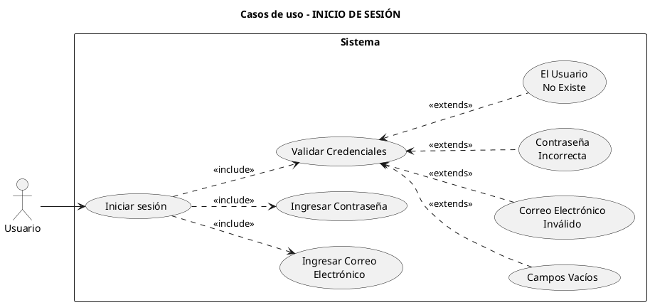

**Relaciones:**
- **<<include>>:** Iniciar sesión incluye de forma obligatoria: Ingresar Correo Electrónico, Ingresar Contraseña y Validar Credenciales.
- **<<extends>>:** Si la validación falla, se ejecuta una de las extensiones: Campos Vacíos, Correo Electrónico Inválido, Contraseña Incorrecta o El Usuario No Existe.

---

## 2. Registro de usuario (diagrama por separado)

El usuario crea una cuenta con nombre completo, correo (dominio gmail, hotmail o dw) y contraseña (mín. 8 caracteres). El flujo principal incluye ingresar datos y validar registro; las alternativas de error extienden la validación.

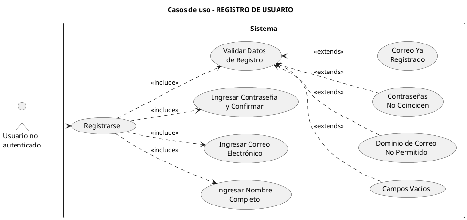

**Relaciones:**
- **<<include>>:** Registrarse incluye de forma obligatoria: Ingresar Nombre Completo, Ingresar Correo Electrónico, Ingresar Contraseña y Confirmar, y Validar Datos de Registro.
- **<<extends>>:** Si la validación falla, se ejecuta una de las extensiones: Campos Vacíos, Dominio de Correo No Permitido (solo gmail, hotmail, dw), Contraseñas No Coinciden o Correo Ya Registrado.

---

## 3. Cerrar sesión (diagrama por separado)

El usuario autenticado cierra su sesión de forma segura. Opcionalmente el sistema solicita confirmación; al confirmar, invalida la sesión en el servidor, elimina la identificación en el navegador y redirige al login.

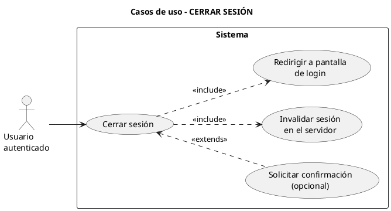

**Relaciones:**
- **<<include>>:** Cerrar sesión incluye: Invalidar sesión en el servidor y Redirigir a pantalla de login.
- **<<extends>>:** Si está configurado, se ejecuta Solicitar confirmación antes de cerrar.

---

## 4. Panel Principal

Métricas en tiempo real: productos agotados, pedidos pendientes de surtir, ocupación del almacén; alertas de productos bajo punto de reorden.

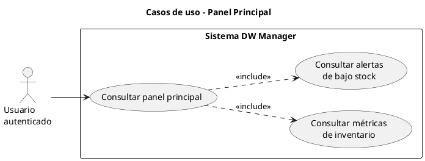

---

## 5. Productos (CRUD y búsqueda)

Gestión completa de productos: listar, buscar por nombre o código, filtrar por categoría, crear, editar y eliminar. Incluye datos: nombre, código, categoría, precio, stock, punto de reorden, pasillo, estante, nivel.

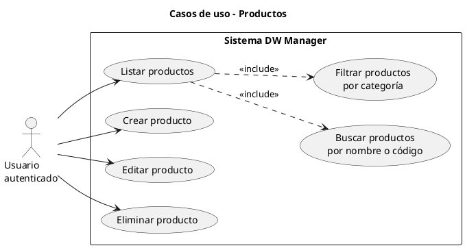

---

## 6. Entradas / Salidas (Movimientos de inventario)

Registro de movimientos: entradas (compra, devolución) y salidas (venta, baja). Actualización automática de stock e historial con observaciones.

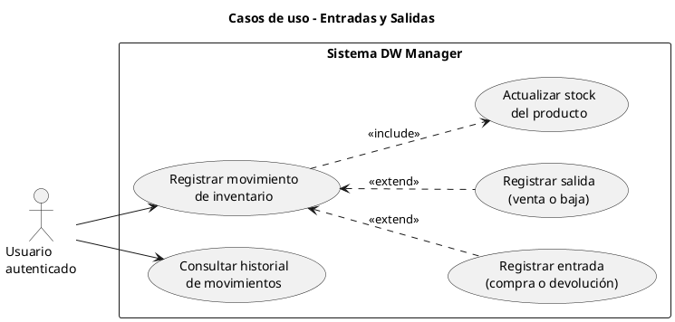

---

## 7. Pedidos y asignación de stock

Crear pedidos (producto, cantidad, prioridad, cliente/referencia), listar pedidos pendientes/parciales/surtidos, y ejecutar asignación de stock según la regla activa (FIFO, mayor prioridad, menor cantidad, etc.).

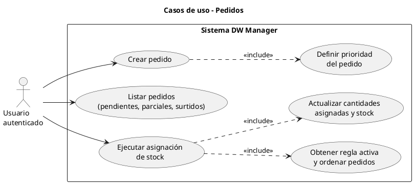

---

## 8. Reglas de asignación (solo Administrador)

Solo el rol administrador ve este módulo. Consultar reglas y activar un criterio: FIFO (primero en llegar), mayor prioridad, menor cantidad primero, o prioridad cliente.

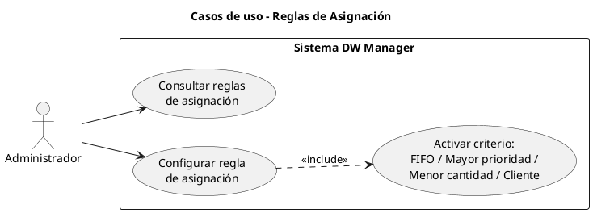

---

## 9. Catálogos: Categorías y Sucursales

CRUD de categorías (nombre) y de sucursales (nombre, ciudad, estado, región). Usados en productos y en el Data Warehouse.

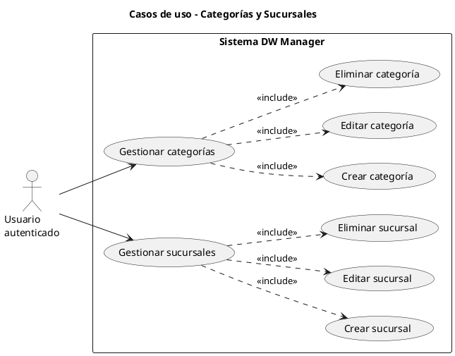

---

## 10. Dashboard OLAP y Análisis Temporal

Consultas sobre el cubo de ventas: KPIs (estadísticas, top productos, ranking sucursales, tendencia mensual), análisis temporal y operaciones OLAP (rollup, drill-down, slice, dice).

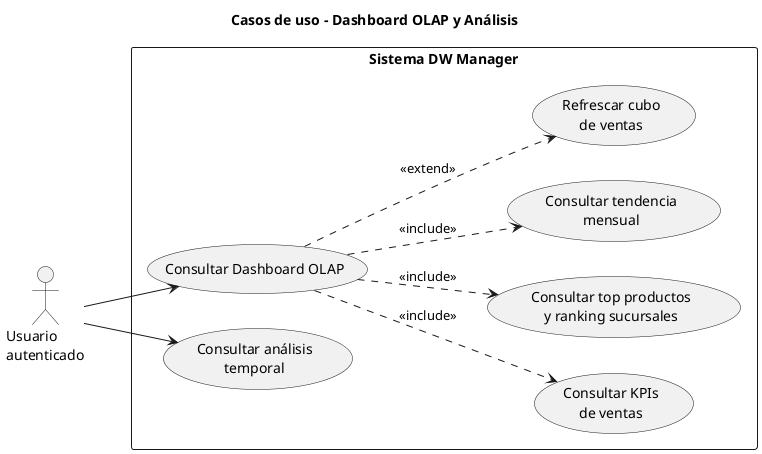

---

## 11. Diagrama completo (todos los casos de uso del sistema)

Agrupa todos los módulos: autenticación, panel principal, productos, entradas/salidas, pedidos, reglas (administrador), categorías, sucursales y dashboard/análisis.

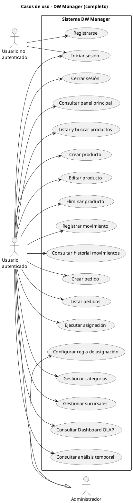

---

## 12. Actores del sistema

Relación entre actores: Administrador es un tipo de Usuario autenticado con permisos adicionales (acceso a Reglas de asignación).

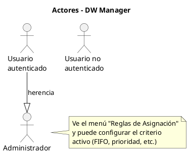

---

## Resumen de módulos vs. casos de uso

| Módulo en el sistema     | Casos de uso principales |
|--------------------------|---------------------------|
| Login / Registro         | Registrarse, Iniciar sesión, Cerrar sesión |
| Panel Principal          | Consultar panel principal (métricas y alertas) |
| Productos                | Listar/buscar/filtrar, Crear, Editar, Eliminar producto |
| Entradas / Salidas       | Registrar movimiento, Consultar historial |
| Pedidos                  | Crear pedido, Listar pedidos, Ejecutar asignación |
| Reglas de Asignación     | Configurar regla (solo Administrador) |
| Categorías               | Gestionar categorías (CRUD) |
| Sucursales               | Gestionar sucursales (CRUD) |
| Dashboard OLAP           | Consultar Dashboard OLAP, KPIs, tendencias |
| Análisis Temporal        | Consultar análisis temporal |

---

## Cómo usar en PlantUML Web

1. Ir a **https://www.plantuml.com/plantuml/uml**
2. Borrar el contenido por defecto.
3. Copiar un bloque completo (desde `@startuml` hasta `@enduml`).
4. Pegar y generar; descargar PNG o SVG si se desea.
