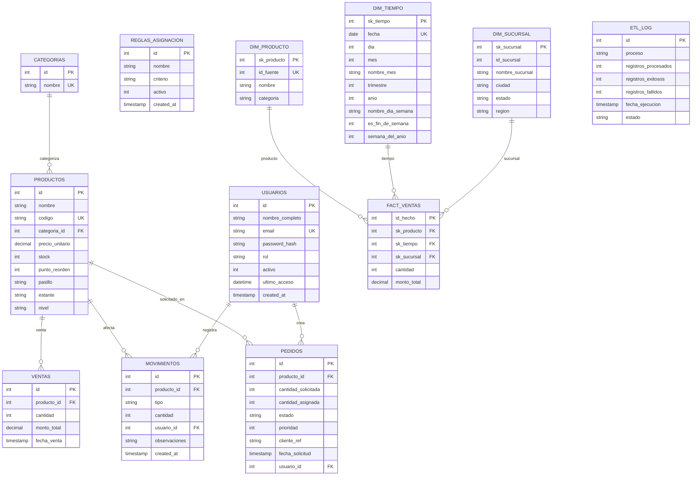

# Diagrama Entidad-Relación - Base de datos DW Manager

Base de datos: **dw_manager**. Incluye tablas transaccionales (inventario, usuarios, pedidos) y tablas del Data Warehouse (dimensiones y hechos de ventas).

---

## Código Mermaid (diagrama ER)

Copia el bloque en editores que soporten Mermaid (GitHub, GitLab, VS Code con extensión, [Mermaid Live](https://mermaid.live)) para generar el diagrama.

### Versión Mermaid simplificada (solo relaciones) (solo relaciones)

---

## Código PlantUML (diagrama ER) (diagrama ER)

Copia el bloque en [PlantUML Web](https://www.plantuml.com/plantuml/uml) para generar la imagen.

---

## Versión simplificada (solo entidades y relaciones, sin atributos)

Útil para presentaciones o vista general.

---

## Resumen de entidades y relaciones

### Tablas transaccionales

| Entidad | Descripción | Relaciones |
|---------|-------------|------------|
| **usuarios** | Usuarios del sistema (login, rol) | Referenciado por movimientos, pedidos |
| **categorias** | Catálogo de categorías de productos | Una categoría tiene muchos productos |
| **productos** | Productos del inventario (nombre, código, precio, stock, ubicación) | Pertenece a una categoría; referenciado por ventas, movimientos, pedidos |
| **ventas** | Registro transaccional de ventas (producto, cantidad, monto) | N:1 con productos |
| **movimientos** | Entradas y salidas de inventario (compra, devolución, venta, baja) | N:1 con productos, N:1 con usuarios |
| **pedidos** | Pedidos con cantidad solicitada, asignada, prioridad y estado | N:1 con productos, N:1 con usuarios |
| **reglas_asignacion** | Reglas para asignar stock (FIFO, prioridad, etc.); solo una activa | Sin FK; uso lógico desde la aplicación |

### Data Warehouse

| Entidad | Descripción | Relaciones |
|---------|-------------|------------|
| **dim_sucursal** | Dimensión sucursal (nombre, ciudad, estado, región) | 1:N con fact_ventas |
| **dim_producto** | Dimensión producto (id_fuente → productos.id, nombre, categoría) | 1:N con fact_ventas |
| **dim_tiempo** | Dimensión tiempo (fecha, mes, trimestre, año, etc.) | 1:N con fact_ventas |
| **fact_ventas** | Hechos de ventas (producto, tiempo, sucursal, cantidad, monto) | N:1 con dim_producto, dim_tiempo, dim_sucursal |
| **etl_log** | Registro de ejecución del ETL | Sin FK |

### Cardinalidades

- **categorias – productos:** 1:N (una categoría, muchos productos).
- **productos – ventas / movimientos / pedidos:** 1:N.
- **usuarios – movimientos / pedidos:** 1:N.
- **dim_producto, dim_tiempo, dim_sucursal – fact_ventas:** 1:N cada una.

---

## Uso en PlantUML

1. Ir a https://www.plantuml.com/plantuml/uml
2. Pegar el código del **primer bloque** (diagrama completo con atributos) o del **segundo** (simplificado).
3. Generar y descargar PNG o SVG si se desea.
